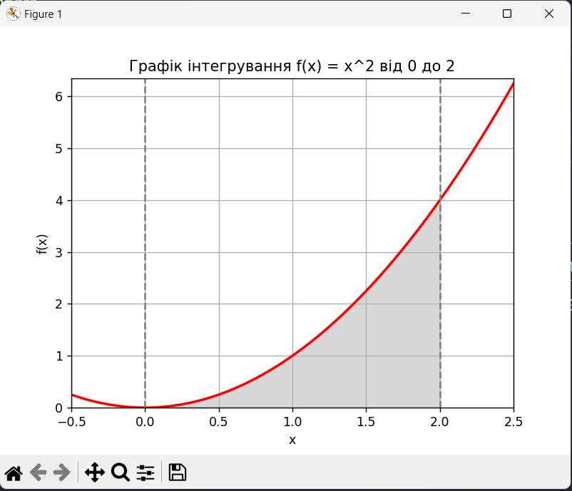

# Linear programming and randomized algorithms

### Task 1. Optimization of production

The company produces two types of drinks: "Lemonade" and "Fruit juice". Different ingredients and a limited amount of equipment are used to produce these drinks. The challenge is to maximize production given limited resources.

**Task conditions:**

1. "Lemonade" is made from "Water", "Sugar" and "Lemon juice".
2. "Fruit juice" is made from "Fruit puree" and "Water".
3. Resource limit: 100 units. "Waters", 50 units. "Sugar", 30 units. "Lemon juice" and 40 units. "Fruit puree".
4. Production of a unit of "Lemonade" requires 2 units. "Waters", 1 unit "Sugar" and 1 unit "Lemon juice".

The production of a unit of "Fruit juice" requires 2 units. "Fruit puree" and 1 unit "Waters".
Using PuLP, create a model that determines how much "Lemonade" and "Fruit Juice" should be produced to maximize the total amount of products, subject to resource constraints. Write a program whose code maximizes the total number of products "Lemonade" and "Fruit Juice" produced, given the constraints on the number of resources.

### Task 2. Calculation of the definite integral.

Your second task is to calculate the value of the integral of the function using the Monte Carlo method.

1. Calculate the value of the integral of the function using the Monte Carlo method, in other words, find the area under this graph (gray area).

2. Check the correctness of the calculations to confirm the accuracy of the Monte Carlo method by comparing the obtained result with analytical calculations or the result of running the quad function. Draw conclusions.

#### Conclusion:

**Accuracy confirmation**

The Monte Carlo method provides an approximate result that is very close to the analytical solution and the result from the quad function. The error is minimal, indicating high accuracy of the Monte Carlo method when using a large number of random points (in this case, 100000).

Therefore, the Monte Carlo method is effective and accurate for calculating integrals, especially when using a sufficient number of random points to achieve the required precision.
